<p align="center">
  
  
  
</p>

<h1 align="center">
  🪐 UvuKCube — Mission Control STL
</h1>

<p align="center">
  <strong>Entrez dans la troisième dimension et bousculez vos pensées, même avec les yeux dans votre poche.</strong><br>
  <em>An open-hardware tactile 3D puzzle engineered for high-contrast and inclusive spatial learning.</em>
</p>

---

> [!IMPORTANT]
> **Projet Solidaire & Inclusif** : L'UvuKCube est un kit matériel conçu pour introduire le célèbre casse-tête tridimensionnel dans les classes d'enfants aveugles ou malvoyants. En imprimant ces fichiers STL, vous donnez aux formes et aux couleurs une réalité sensitive et tactile unique au bout des doigts.

---

## 📺 Démonstration & Aperçus Visuels

<table width="100%" border="0" cellspacing="0" cellpadding="0" style="border-collapse: collapse; border: none;">
  <tr>
    <td width="50%" align="center" valign="top" style="border: none; padding: 10px;">
      <p><strong>Démonstration Plan de Vol</strong></p>
      <a href="https://www.youtube.com/watch?v=Mck8iQaiIPo" target="_blank" title="Regarder la démo sur YouTube">
        
      </a>
    </td>
    <td width="50%" align="center" valign="top" style="border: none; padding: 10px;">
      <p><strong>Rendu Audio-Tactile Intégral</strong></p>
      <a href="https://www.youtube.com/watch?v=-9zXiUNQLnc" target="_blank" title="Regarder le rendu audio-tactile sur YouTube">
        
      </a>
    </td>
  </tr>
</table>

<p align="center" style="margin-top: 20px;">
  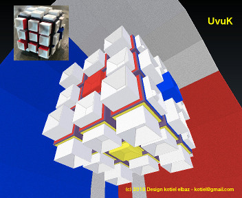
</p>

---

## 🎨 L'Architecture du Cube (Style Mondrian)

L'agencement des pièces utilise les contrastes de la charte neoplasticiste pour structurer la topologie du puzzle. Le cube est composé de **54 Cubignons** imprimés en 3D répartis sur 6 faces selon deux profils de surfaces distincts :

<table>
  <thead>
    <tr>
      <th bgcolor="#d31221" align="center"><font color="#ffffff">🟥 FACES CONVEXES (LaK)</font></th>
      <th bgcolor="#1a56bc" align="center"><font color="#ffffff">🟦 FACES CONCAVES (PiK)</font></th>
    </tr>
  </thead>
  <tbody>
    <tr>
      <td>
        <ul>
          <li><strong>Faces :</strong> Rouge, Jaune, Orange.</li>
          <li><strong>Texture LaK :</strong> Cavités douces et lisses au toucher.</li>
          <li><strong>Topographie :</strong> Centre bas (3mm) ➔ Arêtes moyennes (6mm) ➔ Coins hauts (9mm).</li>
        </ul>
      </td>
      <td>
        <ul>
          <li><strong>Faces :</strong> Bleu, Blanc, Vert.</li>
          <li><strong>Texture PiK :</strong> Cavités dotées d'un bouton central de repère.</li>
          <li><strong>Topographie :</strong> Centre haut (9mm) ➔ Arêtes moyennes (6mm) ➔ Coins bas (3mm).</li>
        </ul>
      </td>
    </tr>
  </tbody>
</table>

---

## 📦 Coffre-Fort des Fichiers STL (3D Asset Vault)

Sélectionnez et téléchargez les modules géométriques conçus sur Blender 3D pour assembler votre matrice.

### 1. Les Cubignons Individuels

| Nom du Fichier | Type Tactile | Hauteur Réelle | Rôle Topologique Standard |
| :--- | :---: | :---: | :--- |
| 📁 `uvuk-lak-3mm.stl` | **LaK** (Lisse) | 3 mm | Centre des faces Convexes |
| 📁 `uvuk-lak-6mm.stl` | **LaK** (Lisse) | 6 mm | Arêtes des faces Convexes |
| 📁 `uvuk-lak-9mm.stl` | **LaK** (Lisse) | 9 mm | Coins des faces Convexes |
| 📁 `uvuk-pik-3mm.stl` | **PiK** (Bouton) | 3 mm | Coins des faces Concaves |
| 📁 `uvuk-pik-6mm.stl` | **PiK** (Bouton) | 6 mm | Arêtes des faces Concaves |
| 📁 `uvuk-pik-9mm.stl` | **PiK** (Bouton) | 9 mm | Centre des faces Concaves |

### 2. Plateaux d'Impression Groupés (Racks Complets)

> [!TIP]
> Pour gagner du temps, utilisez directement les fichiers d'assemblage de faces développés pour les lits d'impression standards.

*   📁 `uvuk-cvx-face.stl` : Contient le groupement nécessaire pour une face convexe complète (Profil LaK).
*   📁 `uvuk-ccv-face.stl` : Contient le groupement nécessaire pour une face concave complète (Profil PiK).

---

## 🛠️ Instructions de Slicing & Assemblage

<details>
<summary>⚙️ Configuration de votre Slicer (Cura / PrusaSlicer)</summary>

*   **Matériau recommandé :** PLA Blanc ou Neutre haute définition.
*   **Résolution :** 0.15mm à 0.2mm pour garantir la netteté de la course des boutons PiK au fond des cavités.
*   **Séparation :** Les Cubignons sont imprimés sur un support fin de 3x3, faciles à détacher à l'aide de ciseaux d'atelier.
</details>

<details>
<summary>🔥 Recommandations de Collage & Peinture Finition</summary>

*   **Fixation :** Le collage des 54 pièces s'exécute parfaitement à l'aide d'un pistolet à colle chaude sur un châssis de Rubik's cube standard. Une colle type cyanoacrylate (Super-Glue) est recommandée pour un usage intensif en milieu scolaire.
*   **Finition Chromatique Contrastée :** Peignez uniquement l'intérieur des parois des Cubignons pointant vers le centre avec la couleur de référence de la face pour préserver la mémoire visuelle résiduelle.
</details>

---

## 🛰️ Spécifications des Alignements Mécaniques

La résolution du cube peut s'effectuer entièrement sans repère visuel en utilisant le gradient de hauteur appliqué aux pièces :

$$\text{Gradient Tactile} = \Delta h = 3\text{mm} \rightarrow 6\text{mm} \rightarrow 9\text{mm}$$

> [!WARNING]
> **Consigne de sécurité CE enfant** : En raison de la présence de 54 micro-cubignons imprimés ou collés à chaud, ce modèle ne convient pas aux enfants de moins de 36 mois (3 ans) suite aux risques d'ingestion de petits éléments.

---

## 📸 Galeries de Modules Tactiles (Asset Carousels)

Les images de composants ci-dessous sont stockées dans le dossier `uvuk-pic/` et configurées sous forme de carousels à défilement horizontal fluide.

### Carousel 1 : Profils Initiaux & Séries de Modules (ap01 - ap05)
<table>
  <tr>
    <td valign="top">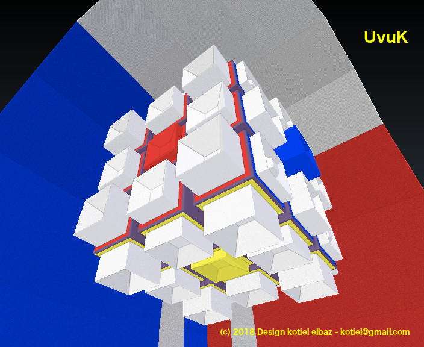<br><center><small>ap01-01</small></center></td>
    <td valign="top">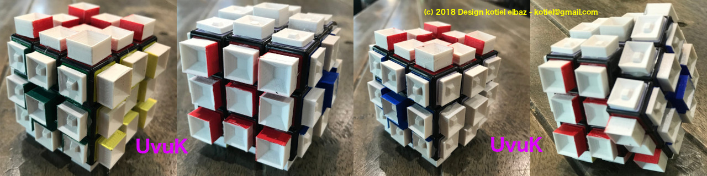<br><center><small>ap01-12</small></center></td>
    <td valign="top">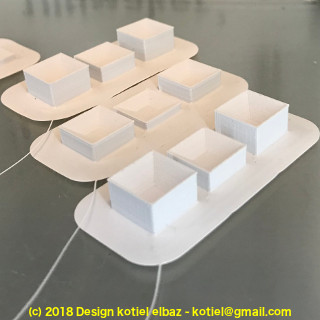<br><center><small>ap01-13</small></center></td>
    <td valign="top">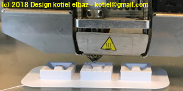<br><center><small>ap01-14</small></center></td>
    <td valign="top">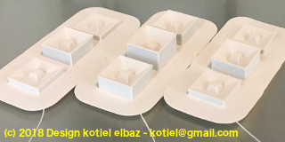<br><center><small>ap01-15</small></center></td>
    <td valign="top">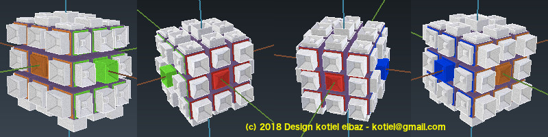<br><center><small>ap04-01</small></center></td>
    <td valign="top">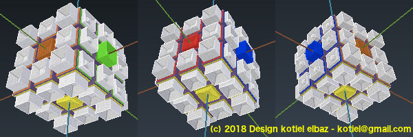<br><center><small>ap04-02</small></center></td>
    <td valign="top">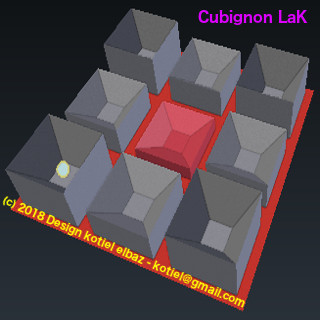<br><center><small>ap04-03</small></center></td>
    <td valign="top">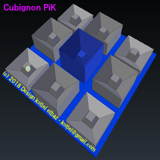<br><center><small>ap04-04</small></center></td>
    <td valign="top">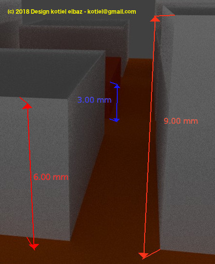<br><center><small>ap04-05</small></center></td>
    <td valign="top">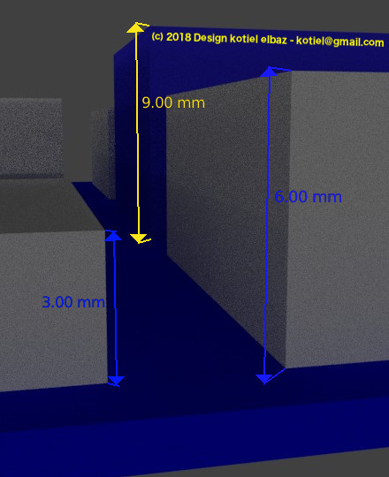<br><center><small>ap04-06</small></center></td>
    <td valign="top">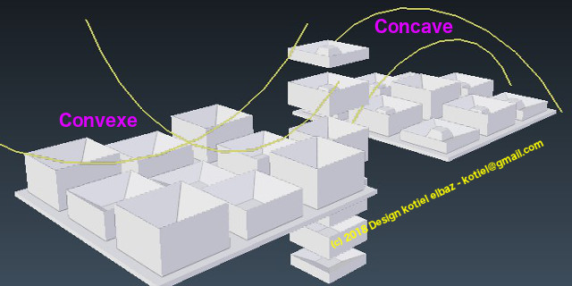<br><center><small>ap05-01</small></center></td>
  </tr>
</table>

### Carousel 2 : Alignements Avancés & Cartographies Bêta (ap06 - ap12)
<table>
  <tr>
    <td valign="top">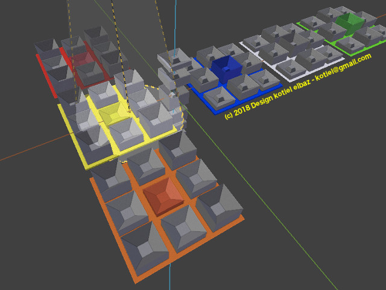<br><center><small>ap06-01</small></center></td>
    <td valign="top">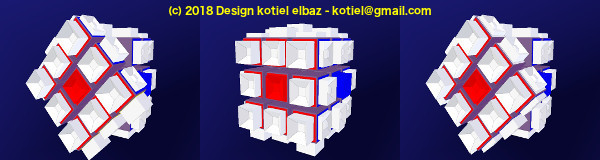<br><center><small>ap07-01</small></center></td>
    <td valign="top">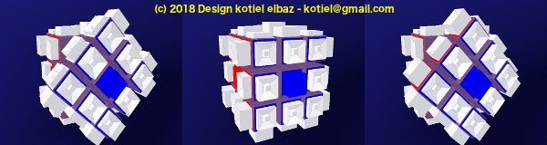<br><center><small>ap07-02</small></center></td>
    <td valign="top">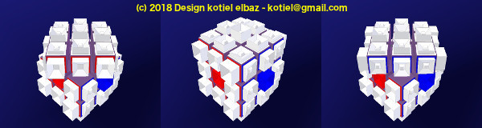<br><center><small>ap07-03</small></center></td>
    <td valign="top">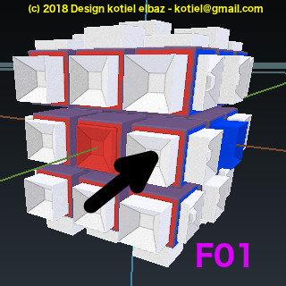<br><center><small>ap09-f01d</small></center></td>
    <td valign="top">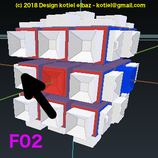<br><center><small>ap09-f02g</small></center></td>
    <td valign="top">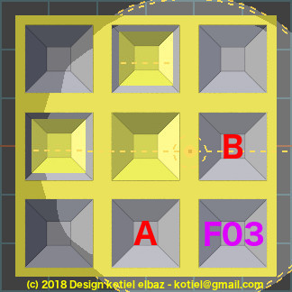<br><center><small>ap10-f03</small></center></td>
    <td valign="top"><br><center><small>f04-rd1</small></center></td>
    <td valign="top">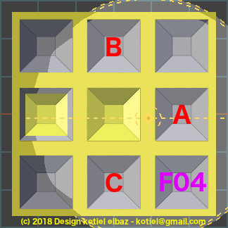<br><center><small>f04-rd2</small></center></td>
    <td valign="top">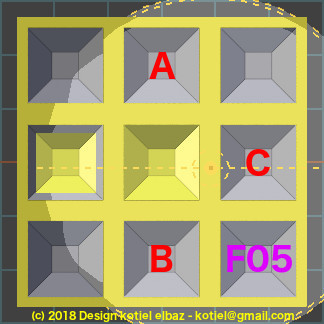<br><center><small>f05-rg1</small></center></td>
    <td valign="top">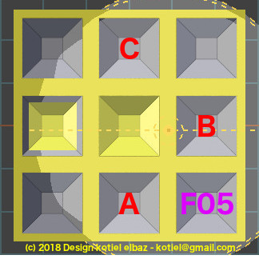<br><center><small>f05-rg2</small></center></td>
    <td valign="top">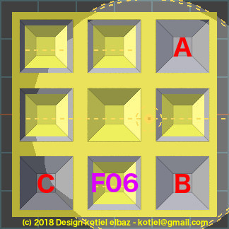<br><center><small>f06-cr1</small></center></td>
    <td valign="top">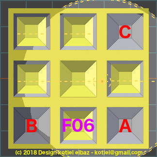<br><center><small>f06-cr2</small></center></td>
    <td valign="top">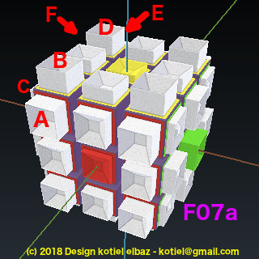<br><center><small>f07a-abcd</small></center></td>
    <td valign="top">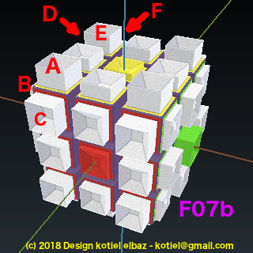<br><center><small>f07a-badc</small></center></td>
  </tr>
</table>

---

## 📖 Documentation & Guides d'Accompagnement

Retrouvez les notices complètes d'assemblage et les livrets pédagogiques officiels en version numérique :
*   🇬🇧 **[English Manual]** ➔ <a href="uvuk-doc-english.pdf" target="_blank">Open English Documentation (PDF)</a>
*   🇫🇷 **[Livret Français]** ➔ <a href="uvuk-doc-french.pdf" target="_blank">Ouvrir la Documentation Française (PDF)</a>

---

## ⚖️ Licence & Droits d'Utilisation

<p align="left">
  <a rel="license" href="http://creativecommons.org/licenses/by-nc-sa/4.0/">
    
  </a>
</p>

Cette œuvre est mise à disposition selon les termes de la **Licence Creative Commons Attribution - Pas d'Utilisation Commerciale - Partage dans les Mêmes Conditions 4.0 International (CC BY-NC-SA 4.0)**. 

Vous êtes libre de dupliquer, modifier et ré-imprimer ces modèles à condition de citer l'auteur original (Kotiel Elbaz), de ne pas en faire un usage commercial et de redistribuer vos modifications sous la même licence.

---

```sign
🚀 Propulsé avec le soutien de La Cité des Sciences Fab Lab Paris.
📬 Communauté Instagram/X : @uvukcube
📧 Contact Direct : uvukcube@gmail.com
